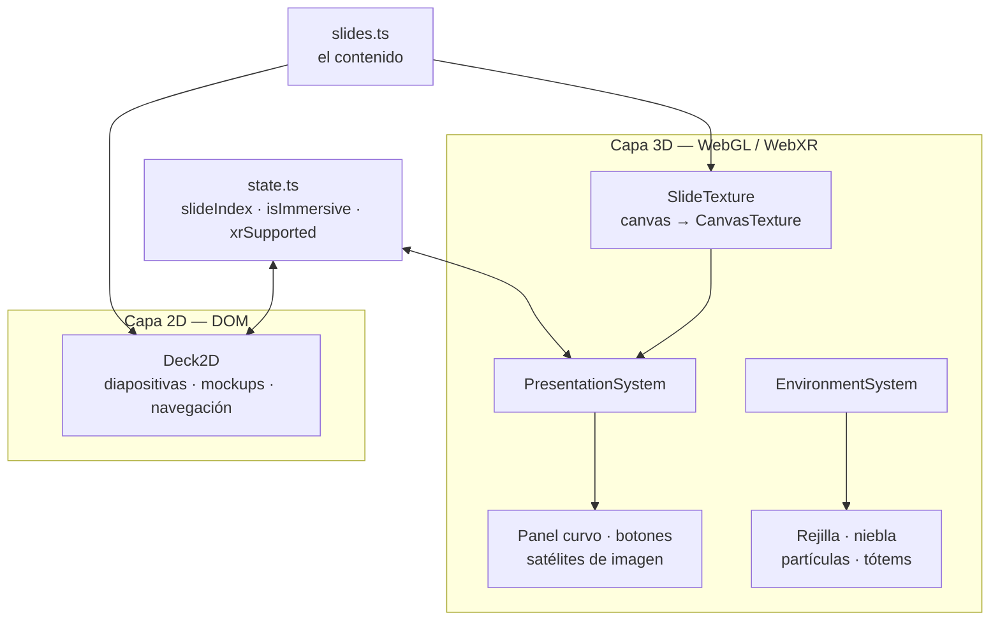

<div align="center">

# WebXR + Agentes de IA

### Destronando la Complejidad del Desarrollo VR Tradicional

_Una mirada evolutiva de la creación en motores 3D al desarrollo asistido en la web inmersiva._

**[▶ Ver la presentación en vivo](https://amleman.github.io/webXR-conference-presentation/)**

[](https://github.com/amleman/webXR-conference-presentation/actions/workflows/deploy.yml)


Charla de **Anthony Alemán** · VR / MR Expert · 2026

</div>

---

## La idea

Una presentación que finge ser un sitio web de diapositivas y no lo es.

El espectador abre un enlace y ve un deck 2D perfectamente normal: títulos,
puntos clave, mockups, flechas de navegación. Lo que no sabe es que **desde el
primer frame hay un mundo 3D corriendo detrás**, con las mismas siete
diapositivas montadas como paneles flotantes.

En la última slide se revela: un botón cambia la capa de render, no la página.
Las gafas se ponen y las diapositivas se materializan alrededor.

El truco no es el efecto: es que la charla **demuestra su propia tesis mientras
la cuenta**. Se argumenta que WebXR elimina la fricción del desarrollo VR
tradicional, y la prueba es que el argumento se está ejecutando en WebXR, servido
desde una URL, sin que nadie instalara nada.

## Lo que la hace distinta

- **Dos capas, un solo estado.** El deck 2D y los paneles 3D leen las mismas
  señales. Cambiar de slide con el teclado, con el ratón, con el gatillo del mando
  o quitarse el visor deja siempre al espectador en el mismo punto. No hay
  sincronización que mantener porque no hay dos verdades.
- **Las imágenes rompen el 16:9.** En 2D se apilan dentro del rectángulo, porque
  es lo único que una pantalla permite. En XR se despegan del panel y flotan a los
  lados y por encima del espectador. La diferencia entre ambas capas _es_ el
  argumento de la charla, hecho geometría.
- **Contraste narrativo integrado en los mockups.** La slide del flujo en Unity
  muestra una consola compilando: `Building APK… 01:47:22`. La del stack web
  muestra una terminal: `ready in 412 ms` · `hmr update — 18 ms`. El público
  entiende la tesis sin que haya que enunciarla.
- **Entorno propio, cero modelos descargados.** Suelo con rejilla cyber, niebla,
  600 partículas y dos tótems geométricos, todo generado en TypeScript. La escena
  completa pesa lo que pesa el bundle.
- **Presupuesto de frame de VR.** Las partículas y la rejilla se animan
  íntegramente en la GPU; el bucle de actualización del entorno escribe un `float`
  por frame y no recorre una sola partícula.

## El guion

| #   | Slide                                                     | Qué sostiene                                                  |
| --- | --------------------------------------------------------- | ------------------------------------------------------------- |
| 1   | Portada                                                   | Título, ponente y año                                         |
| 2   | El Walkthrough Tradicional: Entorno y Flujo en Unity      | Setup, el dilema del testing loop, el coste real en tiempo     |
| 3   | Meta XR SDK, Fortalezas de Unity y Construcción de Mundos | Building Blocks, Interaction SDK, la artesanía que sigue ahí   |
| 4   | WebXR: Inmersión Instantánea, Sin Instalación             | La URL como experiencia; se acaba el ciclo de APK y ADB        |
| 5   | Agentes de IA: el World Building deja de ser Artesanal    | Prompt → escena, assets en la nube, NPCs conversacionales      |
| 6   | Configuración y Desarrollo con IWSDK                      | `npm create iwsdk`, HMR, DevTools, abstracción espacial nativa |
| 7   | Plot twist                                                | La revelación y el salto a inmersivo                          |

## Arranque rápido

Requiere **Node.js 20.19+, 22.12+ o 24+**. El proyecto fija 22.12.0 en [`.nvmrc`](.nvmrc).

```bash
npm install
npm run dev
```

`npm run dev` levanta el servidor gestionado de IWSDK — **no uses `vite` a
secas**. El comando imprime dos URLs; la de red es la que hay que abrir desde el
navegador del visor.

> **WebXR exige un contexto seguro.** El servidor de desarrollo ya sirve por
> HTTPS con un certificado autofirmado: el visor pedirá aceptarlo la primera vez.

| Comando             | Qué hace                                             |
| ------------------- | ---------------------------------------------------- |
| `npm run dev`       | Servidor de desarrollo + navegador gestionado        |
| `npm run typecheck` | `tsc --noEmit` — pásalo **antes** de probar nada      |
| `npm run build`     | Compila a `dist/`                                    |
| `npm run preview`   | Sirve `dist/` localmente                             |
| `npm run dev:down`  | Apaga el servidor gestionado                         |

## Editar el contenido

Todo el texto vive en un solo archivo:
**[`src/presentation/slides.ts`](src/presentation/slides.ts)**.

Es la fuente de verdad única. Añadir una slide ahí la hace aparecer en las dos
capas, con su mockup, sus puntos de progreso y su hueco en la navegación. Ningún
renderer guarda una copia del texto.

```ts
{
  id: 'mi-slide',
  kind: 'content',                       // 'cover' | 'content' | 'reveal'
  title: 'Título de la diapositiva',
  subtitle: 'Una línea de apoyo.',
  bullets: [
    {
      icon: '⚡',
      text: 'Enunciado del punto',
      detail: [                          // sub-puntos, opcionales
        'Se puede citar `código` entre acentos graves',
      ],
    },
  ],
  visual: 'dev-terminal',                // ver tabla abajo
  accent: { hex: ACCENT_EMERALD, kicker: 'MI SECCIÓN' },
  media: [
    { src: 'captura.png', caption: 'Pie', source: 'ejemplo.com',
      aspect: 1.6, placement: 'left' },  // 'left' | 'right' | 'overhead'
  ],
}
```

**Mockups disponibles** (`visual`) — cada uno está dibujado dos veces, en HTML
para la capa 2D y en canvas para la 3D:

| Valor             | Qué dibuja                                                     |
| ----------------- | -------------------------------------------------------------- |
| `unity-editor`    | Editor de Unity: Hierarchy, Inspector, Assets, consola con APK   |
| `building-blocks` | Módulos del Meta XR SDK y el recordatorio de lo que queda manual |
| `webxr-flow`      | URL → Navegador → Inmersión                                     |
| `ai-pillars`      | Los tres pilares de la creación asistida                        |
| `dev-terminal`    | Terminal con `npm run dev` y recargas HMR en milisegundos        |
| `none`            | Sin mockup (portada y revelación)                                |

**Imágenes** — se dejan en [`public/images/`](public/images/README.md) y son
opcionales: si el archivo no está, la figura se retira sola en 2D y el satélite
no aparece en XR. Nunca se ve una imagen rota. El único campo que hay que medir
es `aspect` (ancho ÷ alto): si no coincide con el archivo, el panel la deforma.

## Cómo funciona



Ninguna de las dos capas conoce a la otra. Ambas leen `slideIndex` y ambas llaman
a `next()` / `prev()`. Cuando arranca una sesión XR, `PresentationSystem` publica
el cambio en `isImmersive` y el deck 2D se oculta por su cuenta.

**Cambiar de slide en 3D cuesta una asignación de puntero.** Las siete texturas se
pintan una sola vez al arrancar; la transición sólo reasigna `material.map`. No hay
repintado de canvas ni subida a GPU en mitad de la charla.

## Estructura

```
index.html                          Cáscara del deck 2D · Tailwind (CDN) · tipografías
iwsdk.config.json                   Autoridad del proyecto: escena, assets, componentes, XR
vite.config.ts                      Sólo conecta el plugin de IWSDK

public/
  scenes/main.iwsdk.scene.json      Composición de la escena (sólo IDs del manifiesto)
  images/                           Imágenes opcionales de las slides

src/
  index.ts                          World.create() + registro explícito de sistemas
  assets.ts                         defineAssets() — catálogo compartido runtime/editor
  components.ts                     defineComponents() — manifiesto de componentes

  presentation/
    slides.ts                       CONTENIDO — fuente de verdad de ambas capas
    state.ts                        Señales compartidas
    Deck2D.ts                       Capa DOM: diapositivas, mockups, navegación
    SlideTexture.ts                 Pinta cada slide en un canvas
    PanelBuilder.ts                 Paneles curvos, botones y satélites de imagen
    EnvironmentBuilder.ts           Rejilla cyber, niebla, partículas, tótems
    ecs-components.ts               Declaraciones de componentes (sin sistemas ni DOM)

  scene-assets/*.scene-asset.ts     Prototipos procedurales que referencia la escena
  systems/
    PresentationSystem.ts           Puente entre las dos capas
    EnvironmentSystem.ts            Atmósfera, reloj de shaders, flotación decorativa
```

## Controles

| Dónde            | Acción                                                                   |
| ---------------- | ------------------------------------------------------------------------ |
| **Teclado**      | `←` `→` · `Espacio` · `Inicio` / `Fin` · `V` para entrar en VR             |
| **Ratón, táctil** | Botones, puntos de progreso, deslizar horizontalmente                   |
| **Mando Quest**  | Apuntar y gatillo sobre los botones 3D; `A`/`X` avanza, `B`/`Y` retrocede |

Los botones de cara se usan a propósito en vez del joystick: los thumbsticks
pertenecen a la locomoción, y un presentador que camina no debería cambiar de
diapositiva sin querer. Dentro de VR se puede recorrer la rejilla — el suelo lleva
`LocomotionEnvironment`.

## Compatibilidad

| Plataforma                   | Estado                                            |
| ---------------------------- | ------------------------------------------------- |
| Meta Quest Browser (Quest 3) | Modo inmersivo completo                           |
| Apple Vision Pro (Safari)    | Modo inmersivo — sin verificar en hardware         |
| Chrome / Edge de escritorio  | Deck 2D; inmersivo con Quest Link                 |
| Safari, Firefox, móvil       | Deck 2D                                           |

Sin `immersive-vr` disponible, el botón de VR se sustituye por una nota que
explica el requisito. La presentación nunca se queda sin salida.

## Despliegue

El flujo de trabajo de [`deploy.yml`](.github/workflows/deploy.yml) compila,
comprueba tipos y publica en cada push a `master`.

> **Requisito que no se ve:** en **Settings → Pages → Source** debe estar
> seleccionado **`GitHub Actions`**. Si queda en `Deploy from a branch`, GitHub
> publica la raíz del repositorio sin compilar; el navegador recibe un `index.html`
> que apunta a `/src/index.ts`, no sabe ejecutar TypeScript y la página no carga.

`vite.config.ts` usa `base: './'`, así que la build funciona igual en la raíz de un
dominio que bajo `usuario.github.io/repositorio/`. El flujo añade `.nojekyll` para
que Pages no filtre la carpeta `assets/`.

El visitante descarga **~1,7 MB de JavaScript comprimido** y ~1 MB de imágenes.
Eso es la experiencia entera, sin instalar nada — que es justamente lo que la
charla defiende.

## Decisiones que conviene conocer antes de tocar el código

Este proyecto no es un Vite corriente. Lo que sigue es lo que muerde:

- **`iwsdk.config.json` es la autoridad**, no `vite.config.ts`. Selecciona la
  escena activa, el módulo de assets, el de componentes y las capacidades XR.
- **Three.js se importa desde `@iwsdk/core`**, nunca desde `three`: importarlo
  directo crea una segunda instancia y rompe cosas en silencio.
- **`src/assets.ts` se evalúa dos veces, en dos realms de JavaScript** (runtime y
  editor). Debe ser determinista y libre de efectos: por eso `EnvironmentBuilder`
  usa un PRNG sembrado en vez de `Math.random()` — una nube de partículas distinta
  en cada realm rompería bounds y hashes.
- **Las señales derivadas leen `.value`, nunca `.peek()`.** Un `computed` que espía
  la señal no registra la dependencia y se queda cacheado para siempre. Así es como
  el botón "Anterior" estuvo permanentemente deshabilitado.
- **Los paneles usan `MeshBasicMaterial` y quedan fuera de la niebla.** Son
  pantallas, no objetos iluminados: deben leerse igual desde cualquier ángulo.
- **`xr.offer` está en `"none"` a propósito.** Con `"always"`, el navegador del
  Quest ofrecería la sesión inmersiva por su cuenta y destriparía el final.
- **El suelo necesita `LocomotionEnvironment`.** Sin ese componente el jugador
  atraviesa el mundo, y nada lo advierte.
- **Pasa `npm run typecheck` antes de probar.** Un error de tipos impide que un
  sistema se inicialice sin dejar necesariamente rastro en la consola.

Hay más contexto en [`CLAUDE.md`](CLAUDE.md) y en `.claude/rules/`.

## Créditos

Construido sobre el [Immersive Web SDK](https://github.com/meta-quest/immersive-web-sdk)
de Meta (MIT), con Three.js, Vite y Tailwind CSS.

Las capturas de documentación y de la Asset Store que ilustran las slides son
material de terceros; cada una lleva su atribución impresa bajo la imagen en ambas
capas, y su origen está listado en [`public/images/`](public/images/README.md).
Revisa sus condiciones de uso antes de redistribuir el repositorio.

El repositorio todavía no declara licencia propia. Si va a compartirse más allá de
la charla, conviene añadir un `LICENSE`.
